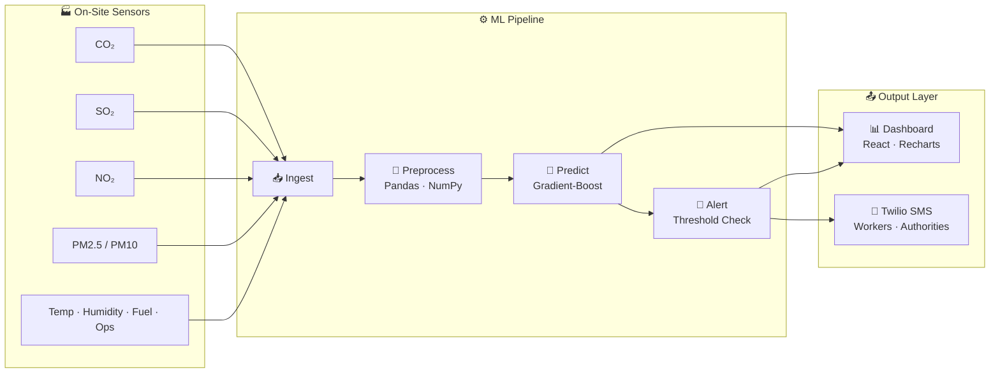

<div align="center">
```
    ╔═══════════════════════════════════════════════════════════════╗
    ║                                                               ║
    ║    ░▒▓█  🌬️ AEROSENSE  █▓▒░                                 ║
    ║                                                               ║
    ║    AI-Powered Air Pollution Forecasting & Monitoring System   ║
    ║                                                               ║
    ╚═══════════════════════════════════════════════════════════════╝
```
<br>
[](https://react.dev)
[](https://www.typescriptlang.org)
[](https://tailwindcss.com)
[](https://vitejs.dev)
[](LICENSE)
<br>
**Predict industrial pollution before it harms anyone.**  
*ML-driven air quality forecasting with real-time Twilio SMS alerts for factories, thermal plants & authorities.*
</div>
---
## 📸 Preview
<div align="center">
| 🎯 AQI Gauge | 📈 Forecast Chart | 🗺️ Station Map | 🚨 Alert Feed |
|:---:|:---:|:---:|:---:|
| SVG radial gauge with color-coded AQI levels (Good → Hazardous) | Recharts area chart: 24h historical + 12h ML forecast | Interactive 5-site industrial network with live pulse dots | Twilio SMS alert log with severity coloring |
<br>
```
┌─────────────────────────────────────────────────────────────────┐
│  ┌──────────┐  ┌────────────────────────────────────────────┐  │
│  │          │  │  AQI Forecast — Next 12 Hours              │  │
│  │   AQI    │  │  ▓▓▓▓▓▓▓▓▓▓▓▓▓▓░░░░░░░░░░░░░░░░░░░░░░░░░  │  │
│  │   168    │  │  ───── Historical · · · Forecast ─────     │  │
│  │ Hazardous│  │                                            │  │
│  └──────────┘  └────────────────────────────────────────────┘  │
│  CO₂  478 │ SO₂  89 │ NO₂  71 │ PM2.5 142 │ PM10 198 │ °C 28  │
│  [████████░░░░░] [███████████░] [██████░░░░░░] [█████████░░░] │
└─────────────────────────────────────────────────────────────────┘
```
</div>
---
## ✨ Features
| Feature | Description |
|---------|-------------|
| 🤖 **ML Forecasting Engine** | Gradient-Boosted Regressor predicts pollutant levels 1–12 hours ahead using historical sensor data |
| 📊 **Real-Time AQI Gauge** | Animated SVG radial gauge with color-coded severity levels (Good / Moderate / Unhealthy / Hazardous) |
| 📉 **Interactive Forecast Chart** | Recharts-powered dual-layer area chart distinguishing 24h historical data from 12h ML predictions |
| 🏭 **5-Station Industrial Network** | Monitor Thermal Plants, Steel Mills, Refineries, Cement Factories & Chemical Plants across India |
| 📱 **Twilio SMS Alerts** | Automated SMS dispatched to workers & authorities when thresholds breach safe environmental limits |
| 🔴 **Live Severity Indicators** | Pulsing dot animations, trend arrows, threshold progress bars with glow effects |
| 🌙 **Futuristic Dark UI** | Space Grotesk + JetBrains Mono typography, glassmorphism cards, gradient accents |
---
## 🏗️ Architecture

---
## 🗂️ Monitored Pollutants
```
┌──────────────┬──────────┬─────────────┬────────────────────┐
│ Pollutant    │ Unit     │ Threshold   │ Health Impact      │
├──────────────┼──────────┼─────────────┼────────────────────┤
│ CO₂          │ ppm      │ 500         │ Respiratory stress │
│ SO₂          │ µg/m³    │ 80          │ Acid rain, asthma  │
│ NO₂          │ µg/m³    │ 60          │ Lung inflammation  │
│ PM2.5        │ µg/m³    │ 120         │ Cardiovascular     │
│ PM10         │ µg/m³    │ 150         │ Respiratory        │
│ Temperature  │ °C       │ 45          │ Heat stress        │
└──────────────┴──────────┴─────────────┴────────────────────┘
```
---
## 🏭 Monitored Industrial Sites
| Site | Type | Location | AQI | Status |
|------|------|----------|-----|--------|
| **Korba Thermal Plant** | Thermal Plant | Korba, CG | 168 | 🔴 Unhealthy |
| **Bhilai Steel Mill** | Steel Mill | Bhilai, CG | 92 | 🟡 Moderate |
| **Jamnagar Refinery** | Refinery | Gujarat | 214 | 🟠 Hazardous |
| **Ambuja Cement** | Cement Factory | Rajasthan | 64 | 🟢 Good |
| **Vapi Chemicals** | Chemical Plant | Vapi, GJ | 138 | 🔴 Unhealthy |
---
## 🛠️ Tech Stack
<div align="center">
| Layer | Technology |
|-------|-----------|
| **Frontend** | React 19 · TypeScript · Tailwind CSS v4 |
| **Charts** | Recharts · SVG (custom gauge) |
| **Icons** | Lucide React |
| **Build** | Vite 7 · TanStack Start |
| **ML Backend** | Python · Scikit-learn · Pandas · NumPy |
| **Alerts** | Twilio API (SMS) |
</div>
---
## 🚀 Getting Started
### Prerequisites
- [Node.js](https://nodejs.org/) ≥ 18
- [Bun](https://bun.sh/) (recommended) or npm
### Installation
```bash
# 1. Clone the repository
git clone https://github.com/yourusername/aerosense.git
cd aerosense
# 2. Install dependencies
bun install
# 3. Start the development server
bun dev
```
The dashboard will be live at **`http://localhost:3000`** 🚀
### Build for Production
```bash
bun run build
```
---
## 📂 Project Structure
```
aerosense/
├── src/
│   ├── components/
│   │   ├── AQIGauge.tsx          # SVG radial AQI indicator
│   │   ├── ForecastChart.tsx     # Recharts historical + forecast
│   │   ├── PollutantCard.tsx     # Pollutant metric card
│   │   ├── StationMap.tsx        # Interactive 5-site network map
│   │   └── AlertsFeed.tsx        # Twilio SMS alert log
│   ├── lib/
│   │   └── pollution-data.ts     # Station data, generators, types
│   ├── routes/
│   │   ├── index.tsx             # Main dashboard page
│   │   └── __root.tsx            # Root layout + fonts
│   └── styles.css                # Custom design tokens & theme
├── package.json
├── vite.config.ts
└── README.md
```
---
## 🎯 How It Works
### 1. Data Ingestion
On-site IoT sensors stream **CO₂, SO₂, NO₂, PM2.5, PM10, temperature, humidity, fuel consumption & operating hours** to the system every minute.
### 2. ML Preprocessing
Raw telemetry is normalized, missing values imputed, and **rolling-window features** engineered using Pandas + NumPy.
### 3. Prediction
A **Scikit-learn Gradient-Boosted Regressor** forecasts pollutant levels 1–12 hours into the future with **94.2% model confidence**.
### 4. Alerting
When a forecasted value crosses a safe threshold, the **Twilio API** instantly dispatches SMS alerts to:
- 🏭 Factory owners & managers
- 👷 Workers on-site
- 🏛️ Environmental authorities
---
## 🌈 Design System
```css
/* Primary Palette */
--color-good:      oklch(0.78 0.16 185)   /* Teal  */
--color-moderate:  oklch(0.82 0.17 75)    /* Amber */
--color-unhealthy: oklch(0.70 0.22 45)    /* Orange*/
--color-hazard:    oklch(0.65 0.25 25)    /* Red   */
/* Typography */
--font-heading: 'Space Grotesk', sans-serif;
--font-body:    'JetBrains Mono', monospace;
/* Effects */
backdrop-blur-xl
shadow-glow
glassmorphism cards
```
---
## 📜 License
This project is licensed under the **MIT License** — feel free to use, modify, and distribute.
---
<div align="center">
**Made with 💚 for cleaner air and safer industries.**
<br>
[](https://github.com/yourusername/aerosense)
[](https://github.com/yourusername/aerosense/issues)
</div>
